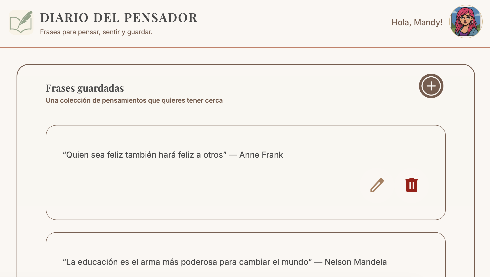
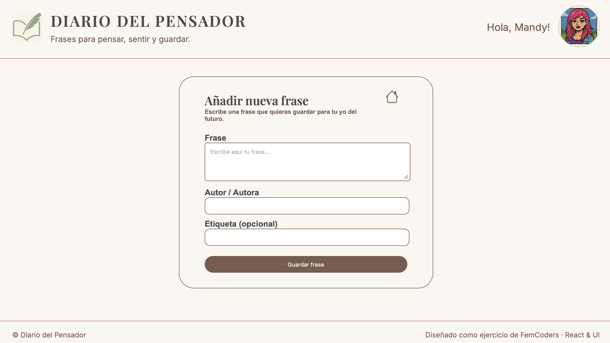

# Diario del Pensador

## Descripción General

**Diario del Pensador** es una aplicación web desarrollada con React que permite a los usuarios gestionar una colección personal de frases reflexivas y motivadoras. La aplicación implementa un flujo completo de operaciones CRUD (Crear, Leer, Actualizar y Eliminar), siguiendo una arquitectura modular basada en **Atomic Design**, con foco en escalabilidad, mantenibilidad y una experiencia de usuario clara e intuitiva.

El proyecto aplica buenas prácticas de desarrollo frontend moderno, incluyendo separación de responsabilidades, reutilización de componentes, control de estado eficiente y navegación mediante rutas dinámicas.

---

## Capturas de Pantalla

> Las siguientes imágenes muestran las principales vistas de la aplicación.

### Vista Principal – Listado de Frases



### Vista de Creación de Nueva Frase



---

## Recursos de Diseño y Planificación

* **Diagrama de flujo / User Flow (Miro)**
  [https://miro.com/app/board/uXjVGcJuHvI=/](https://miro.com/app/board/uXjVGcJuHvI=/)

* **Diseño de Interfaz (Figma)**
  [https://www.figma.com/design/2fAClDYGHQfpY8SPI3AQxl/Diario-del-Pensador](https://www.figma.com/design/2fAClDYGHQfpY8SPI3AQxl/Diario-del-Pensador)

## Stack Tecnológico

### Frontend

* **React.js**

  * Componentes funcionales
  * Hooks (`useState`, `useEffect`)
* **React Router DOM**

  * Navegación entre vistas
  * Rutas dinámicas
* **JavaScript (ES6+)**

### Estilos

* **CSS3**
* Enfoque de estilos orientado a componentes
* Diseño responsive (mobile-first)

### Arquitectura y Patrones

* **Atomic Design**
* Arquitectura basada en componentes
* Lifting State Up
* Controlled Components

### Herramientas de Desarrollo

* **Vite**
* **Visual Studio Code**
* **Git & GitHub**
* **npm**

---

## Arquitectura de la Aplicación (Atomic Design)

La interfaz se estructura siguiendo la metodología **Atomic Design**:

### Átomos

* Botones de acción (Add, Edit, Delete, Save, Init)
* Inputs de texto
* Labels
* Tipografía base

### Moléculas

* Campos de formulario (input + label + validación)
* Tarjetas de frases
* Bloques de acciones

### Organismos

* Formulario de creación y edición de frases
* Listado dinámico de frases

### Templates

* Layout general de la aplicación:

  * Header
  * Main Content
  * Footer

### Pages

* Home (Listado de frases)
* Create New Phrase
* Edit Phrase

---

## Flujo de Usuario

1. El usuario accede a la aplicación y visualiza la lista de frases guardadas.
2. Puede añadir una nueva frase completando el formulario (frase y autor).
3. Al guardar, la frase se añade automáticamente al listado principal.
4. El usuario puede:

   * Editar una frase existente.
   * Eliminar una frase.
5. Tras crear o editar una frase, la aplicación redirige al listado principal con feedback visual.

---

## Requisitos Funcionales

* Listar todas las frases con su autor correspondiente.
* Crear nuevas frases con validación de campos.
* Editar frases existentes.
* Eliminar frases.
* Navegación fluida entre vistas mediante React Router.
* Interfaz responsive y accesible.

---

## Instalación y Ejecución en Local

Para ejecutar el proyecto en tu entorno local:

```bash
# Clonar el repositorio
git clone https://github.com/lorenasferreira/diario-del-pensador.git

# Acceder a la carpeta del proyecto
cd diario-del-pensador

# Instalar dependencias
npm install

# Ejecutar la aplicación
npm run dev
```

La aplicación se abrirá por defecto en:
`http://localhost:5173`

---

## Notas de Code Review

Durante el desarrollo se priorizó:

* Uso de `useState` para la gestión del estado de las frases.
* Uso de `useEffect` para efectos secundarios y sincronización.
* Comunicación clara entre componentes mediante props.
* Separación entre lógica de negocio y presentación.
* Estructura escalable orientada a crecimiento futuro del proyecto.

---

## Mejoras Futuras

* Persistencia de datos mediante backend o base de datos.
* Autenticación de usuarios.
* Sistema avanzado de etiquetas.
* Búsqueda y filtrado de frases.
* Tests unitarios y de integración.